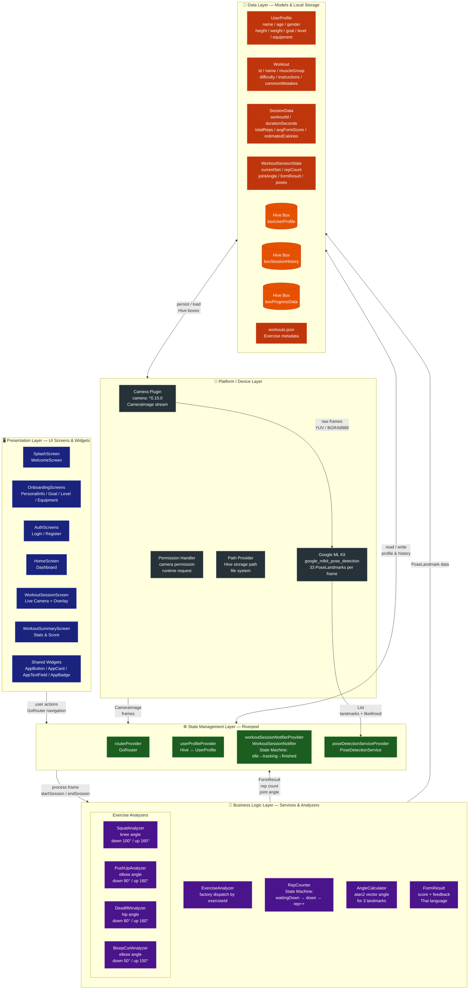

# ภาพที่ 3.1 ภาพรวมสถาปัตยกรรมระบบ FormAI (Layer Diagram)



---

## คำอธิบายแต่ละ Layer

| Layer | ชื่อ | เทคโนโลยี | หน้าที่ |
|-------|------|-----------|---------|
| **L1** | Presentation | Flutter Widgets, Material 3 | แสดงผล UI, รับ input จากผู้ใช้ |
| **L2** | State Management | Riverpod, GoRouter | จัดการ state และ navigation |
| **L3** | Business Logic | Dart classes | วิเคราะห์ท่าออกกำลังกาย, นับ rep, คำนวณมุม |
| **L4** | Data | Hive, JSON | เก็บข้อมูลผู้ใช้และประวัติการออกกำลังกาย |
| **L5** | Platform/Device | ML Kit, Camera Plugin | ประมวลผล pose detection จาก camera |

---

## Data Flow: การประมวลผล 1 frame

```
Camera Hardware
    │  CameraImage (YUV/BGRA8888)
    ▼
PoseDetectionService
    │  InputImage → ML Kit
    │  List<Pose> (33 landmarks × x,y,z,likelihood)
    ▼
WorkoutSessionNotifier.processFrame()
    │
    ├─► AngleCalculator.calculateAngle(hip, knee, ankle)
    │       └─► jointAngle: double
    │
    ├─► ExerciseAnalyzer.analyze(pose, angle)
    │       └─► FormResult(score, feedback)
    │
    └─► RepCounter.update(angle)
            └─► bool repCompleted
                    │
                    ▼
            WorkoutSessionState (updated)
                    │
                    ▼
            WorkoutSessionScreen re-renders
```
